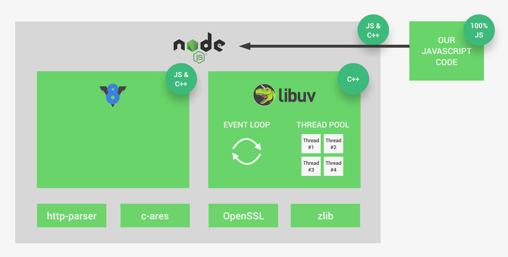
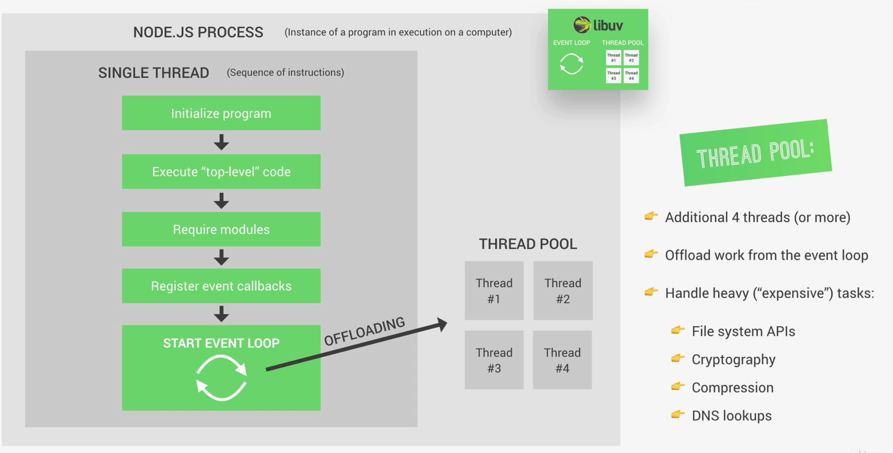
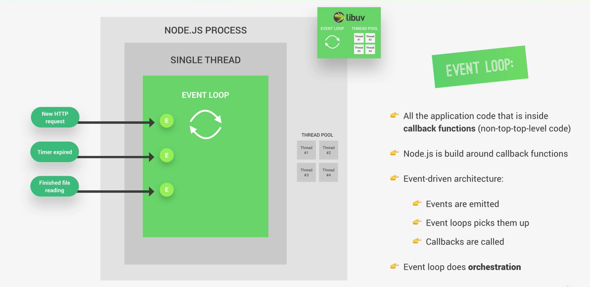
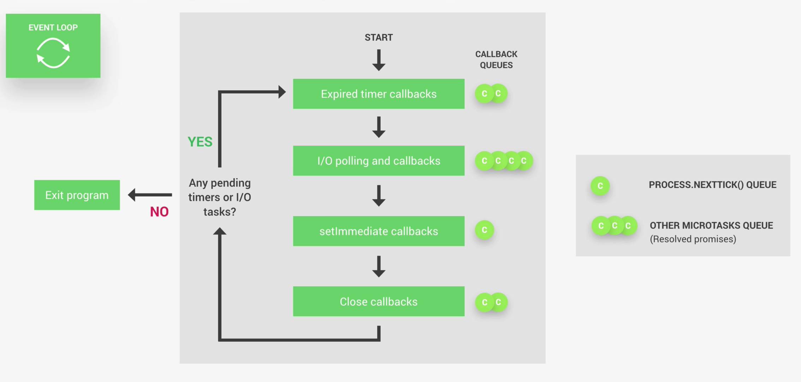
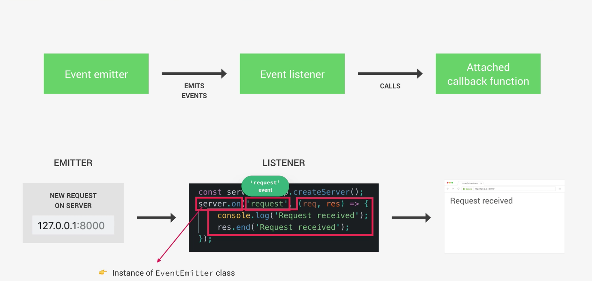
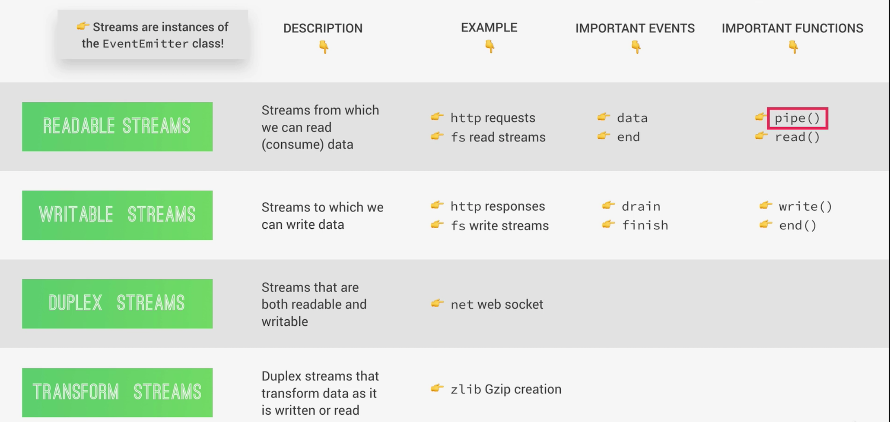
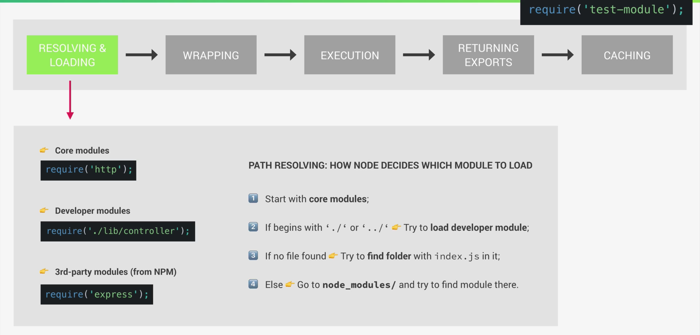

### Reference [Udemy Course](https://www.udemy.com/share/101Wv6AkUadVlUQXo=/) by [Jonas Schmedtmann](https://www.udemy.com/user/jonasschmedtmann/)
___
# What is Nodejs ?
> NodeJS is a JavaScript Runtime.
>
> Built on Google's open-source V8 JavaScript engine.

> **Suitable for:**
>
>>1. To run JavaScript outside of a browser.
>>2. Node is perfect for building super fast, scalable data-intensive web applications.
>>3. Building an API with a database behind it
>>4. preferably a non-relational NoSQL database like MongoDB
>>5. Data streaming apps like youtube and Netflix

> **Not suitable for:**
>>1. Some super heavy server-side processing, like having image manipulations, video conversion, file compression or anything like that.


# How to install nodejs ?
> Go to <https://nodejs.org/en/>
>
>select your os, download and install.

# How to run nodejs?
> Open terminal/cmd
```javascript
node -v     // this will show the version of node.
v14.15.0
```
```javascript
node        // this will open REPL session. Here any java script code will run.
Welcome to Node.js v14.15.0.
Type ".help" for more information.
> .help
.break    Sometimes you get stuck, this gets you out
.clear    Alias for .break
.editor   Enter editor mode
.exit     Exit the REPL
.help     Print this help message
.load     Load JS from a file into the REPL session
.save     Save all evaluated commands in this REPL session to a file

Press Ctrl+C to abort current expression, Ctrl+D to exit the REPL
```
> How to exit?
```
>.exit
```
>Few tips and tricks:
>
>1. Press tab twice to see all env variable and node core modules
>2. Type any name you got from previous step to find more details about the module.
>```javascript
> // pressed tab twice 
> >
>Array                 ArrayBuffer           Atomics               BigInt                BigInt64Array         BigUint64Array        Boolean               Buffer
>
> > Array
>[Function: Array]
> >
> ```

# Using core modules
> For example how to read a file using `fs` core module
```javascript

const fs = require('fs'); // loads fs module

const fileContent =  fs.readFileSync('./input.txt','utf-8');  // reads file in synchronous mode

console.log(fileContent);   // logs the content of file to the console.

```

># How Node.js works? 
>## **Architecture**
>
>
> * Node runtime has several dependencies
>   * Like V8 engine and libuv.
> * V8 engine is what converts JavaScript code into machine code that a computer can actually understand.
> * Libuv is used to implement server side functionality for node.js
>   * This layer is what gives Node access to the underlying computer operating system,file system, networking, and more.
>   * Besides that, libuv also implements two extremely important features of Node.JS which are the event loop and also the thread pool.
>       * The event loop is responsible for handling easy tasks like executing call backs and network IO while the thread pool is for more heavy work like file access or compression etc.
> * libuv is actually completely written in C++ and not in JavaScript.
> * V8 itself, also uses C++ code besides JavaScript.
> * Node does actually not only rely on V8 and libuv, but also on http-parser for parsing http, c-ares or something like that for some DNS request stuff, OpenSSL for keptography, and also zlib for compression.
> ---
>## **Process and Threads**
>
>
>   * When the program is initialized, all the top level code is executed,
>       * which means all the code that is not inside any callback function.
>   * Next all the modules that your app needs are required
>   * Next all the callbacks are registered
>   * After all that, the event loop finally starts running.
>       * most of the work is done in event loop
>       * Event loop is the heart of node.js
>   * But here is the catch, some tasks are actually too heavy. They are too expensive to be executed in the event loop because they would then block the single thread. And so, that's where the thread pool comes in.
>   * Thread pool is also implemented in libuv
>       * So, the thread pool gives us four additional threads that are completely separate from the main single thread.
>       * And we can actually configure it up to 128 threads.
>
>>### **Important note:**
>>`The event loop can then automatically offload heavy tasks to the thread pool. And all this happens automatically behind the scenes. It's not us developers who decide what goes to thread pool and what doesn't. Now, the expensive tasks that do get offloaded are all operations dealing with files, everything related to cryptography, like caching passwords, then all compression stuff, and also DNS lookups, which basically matches web domains to their corresponding real IP addresses. So this is the stuff that would most easily block the main thread. And so, Node takes care of automatically offloading them into the thread pool, where they don't block our event loop. And that is the most important`
> ---
>## **Event Loop**
>
>   * Node.js is all built around **`callback functions`**.
>       * The functions that are called as soon as some work is finished some time in the future.
>   * It works this way because Node uses an event-triggered architecture.
>> `Things like receiving an HTTP request on server or a timer expiring or a file finishing to read, all these will emit events as soon as they are done with their work, and the event loop will then pick up these events and call the callback functions that are associated with each event`.
> 
>> `So, again, the event loop receives events each time something important happens, and will then call the necessary callbacks such as we define in our code. So, in summary, it's usually said that the event loop does the orchestration, which simply means that it receives events, calls their callback functions, and offloads the more expensive tasks to the thread pool.`
>
>### **Event loop in detail**
>
>   * Event loop has mainly 4 phases
>       * Each phase of event loop has it's own call back queues.
>   * The first phase takes care of callbacks of expired timers, for example, from the setTimeout() function.
>       * If a timer expires later during the time when one of the other phases are being processed, then the callback of that timer will only be called as soon as the event loop comes back to this first phase. 
>   * Next phase is I/O polling and execution of I/O callbacks.
>   * Next phase is for setImmediate callbacks.
>       * setImmediate is a special kind of timer that we can use if we want to process callbacks immediately after the I/O polling and execution phase, which can be important in some more advanced use cases.
>   * And finally, the fourth phase is for close callbacks.
>       * Basically, in this phase, all close events are processed, for example, for when a web server or a WebSocket shut down.
>
>   * Node simply checks whether there are any timers or I/O tasks that are still running in the background, and if there aren't any, then it will exit the application. But if there are any pending timers or I/O tasks, well, then it will continue running the event loop and go straight to the next tick.
>> `tick` : One complete cycle of event loop is called as tick.
>
>> `But besides these four callback queues that we just saw, there are actually two other queues, the `nextTick() ` queue and the other ` microtasks ` queue, which is mainly for resolved promises.`
>
>> `nextTick()` is a function that we can use when we really, really need to execute a certain callback right after the current event loop phase. It's a bit similar to setImmediate, with the difference that setImmediate only runs after the I/O callback phase.
>---
>## **Event Driven Architecture**
>
>
>   * In Node, there are certain objects called event emitters that emit named events
>       * Example:
>           * like a request hitting server 
>           * A timer expiring 
>           * A file finishing to read.
>   * These events can then be picked up by event listeners that we developers set up, which will fire off callback functions that are attached to each listener.
>
>### **How to create own event emitter and use them**
>```javascript
>const EventEmitter = require('events'); 
>
>const myEmitter = new EventEmitter();
>
>myEmitter.on("newEvent",()=>{
>  console.log("New event has occured");
>});
>
>myEmitter.on("newEvent", argument =>{
>  console.log(`New event has occured ${argument}`);
>});
>
>myEmitter.emit("newEvent",90);
>```
>---
>## **Streams**
>   * Streams are yet another fundamental concept in Node.JS.
>   * With streams we can process means read and write data piece by piece without completing the whole read or write operation. Therefore we don't have to keep all the data in memory to do these operations.
>   * For example, when we read a file using streams, we read part of the data, do something with it, then free our memory, and repeat this until the entire file
>   * Nextflix and Youtube are best examples for streams. They stream videos using similar principle.
>
> 
>   *   Streams re instances of EventEmitter class hence they emit and listen to named events.
>
>### **How to stream**
>```javascript
>    const fs = require('fs');
>    const server = require('http').createServer();
>
>    server.on("request",(req,res) => {
>       
>        // Read file and sent to response using stream
>        
>        // const  readable = fs.createReadStream("introduction_to_nodejs.MD");
>        // readable.on("data", chunk => {
>        //     res.write(chunk);
>        // });
>        // readable.on("end", () => {
>        //     res.end();
>        // });        
>        // readable.on("error", () => {
>        //     res.statusCode = 500;
>        //     res.end("Some error occurred while reading the file.");
>        // });        
>        
>        
>        // Most efficient way to write:
>        const  readable = fs.createReadStream("introduction_to_nodejs.MD");
>        readable.pipe(res);
>        readable.on("error",()=>{
>            res.statusCode = 500;
>            res.end("Some error occurred while reading the file.");
>        });
>    });
>
>    server.listen(8000,'0.0.0.0',() => {
>        console.log("Server listening on 8000");
>    });
>```
>---
>## **Module system**
>### Commonjs module system
>   * In node we use common js module system.
>
>### Steps involved in loading a module:
>
>
>#### **Step 1**: Resolving and Loading   
>   * It will first try to load a core module with that name.
>       * example, the http module
>       * It will automatically find a path to that module and load it.
>   * If the path starts with a dot, or two dots, it means that it's a developer module.
>       * node will try to load that file, but if there is no file with that name, then it will look for a folder instead. And will load `index.js` in that folder.
>   * And finally, if the required module is neither a core module, nor a developer module, node will assume it's a module from npm.
>       * These third party modules are stored in a node module folder, so node will step into that folder and try to find a module there and then load it
>#### **Step 2**: WRAPPING
>   * After the module is loaded, the module's code is wrapped into a special function which will give us access to a couple of special objects.
>   * Node does actually not directly the execute the code that we rewrite into a file, but instead, the wrapper function that will contain our code in it's body.
>   * It also passes the exports, require module, file name, and dir objects into it.
>       * So that is why in every module we automatically have access to stuff like the require function. 
>       * So these are basically like global variables that are injected into each and every module.
>```javascript
>   // wrapper function looks something like below:
>   (function (exports,require,module,__filename,__dirname){
>       // module code goes here 
>   });
>```
>#### **Step 3**: EXECUTION
>   * Next up, the code in the module, or to be more precise, in the module's wrapper function, actually gets executed by the NODE.JS runtime.
>#### **Step 4**: RETURNING EXPORTS
>   * Now, it's time for the require function to actually return something.
>   * And what it returns is the exports of the required module.
>       * These exports are stored in the module.exports objects.
>#### **Step 5**: CACHING
>   * The last step is that modules are actually cached after the first time they are loaded.
>   * What this means is that if you require the same module multiple times, you will always get the same result.
>   * And the code in the modules is actually only executed in the first call.
>   * In subsequent calls, the result is simply retrieved from cache.
>
>#### **How to create module file and export and use it in a program :**
>> ##### **Method 1**: when only one object is exported eg: A class. 
>>> **testmodule.js**
>>>```javascript
>>>  class Calculator{
>>>      add(a,b) {
>>>          return a+b;
>>>      }
>>>      mul(a,b){
>>>          return a*b;
>>>      }
>>>  }
>>>  module.exports = Calculator;
>>>```
>>
>>> **main.js**
>>>```javascript
>>>   const C = require('./testmodule');
>>>   const calc = new C();      
>>>   console.log(calc.add(7,5));
>>>   console.log(calc.mul(7,5));
>>>```
>>
>>> **Output**
>>>```javascript
>>> 12
>>> 35
>>>```
>> ##### **Method 2**: when multiple objects are exported.
>>> **testmodule.js**
>>>```javascript
>>> export.add = (a,b) => a + b;
>>> export.mul = (a,b) => a * b;
>>>```
>>
>>> **main.js**
>>>```javascript
>>>   const calc = require('./testmodule');
>>>   console.log(calc.add(7,5));
>>>   console.log(calc.mul(7,5));
>>>```
>>
>>> **Output**
>>>```javascript
>>> 12
>>> 35
>>>```
>>>.


